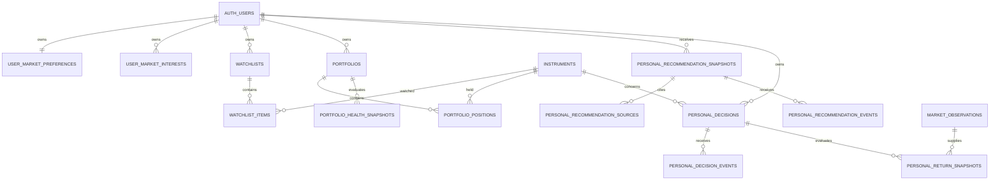

# My Dashboard Contract v1

**Gate:** MYDASH-001 — Product, data and calculation contract  
**Status:** PRODUCER REVISED CANDIDATE — IN REVIEW  
**Contract version:** `my-dashboard-contract-v1`  
**Calculation version:** `personal-forward-return-v1`  
**Portfolio Health version:** `portfolio-health-v1`  
**Recommendation version:** `personal-research-relevance-v1`  
**Prepared:** 27 August 2026  
**Production effects:** none — this document proposes later work and does not represent deployed schema or UI

## 1. Product boundary

My Dashboard is an authenticated personal research workspace at `/my-dashboard`. It is not a trading account, financial-advice service, broker connection or permission to move money.

Only permanent Supabase Auth users may enter the workspace. Signed-out and Supabase anonymous users receive a sign-in state containing no personal rows. Existing public Markets, Assessments and Opportunities pages remain the canonical research drill-throughs.

### Route and tabs

The route uses `?tab=<key>` so refresh, direct links, Back/Forward and keyboard focus preserve the selected workspace.

| Order | Key | Tab | Contract |
|---:|---|---|---|
| 1 | `today` | Today | Material changes, stale/missing data, open decisions nearing a checkpoint, portfolio review warnings and new relevant evidence |
| 2 | `recommendations` | Recommendations | Explainable personal research shortlist; never an automatic Buy instruction |
| 3 | `watchlists` | Watchlists | Reuse the owner's existing private lists, notes and ordering |
| 4 | `opportunities` | Opportunities | Long-term themes relevant to watched or held instruments; preserve Opportunity independence |
| 5 | `portfolio-health` | Portfolio Health | Positions, valuation completeness, concentration, allocation, theme/currency exposure and simulated return |
| 6 | `decision-lab` | Decision Lab | Immutable AI-signal and user-paper decisions with forward 5/20/60-session outcomes |

Interaction requirements:

- semantic tablist with Arrow Left/Right, Home/End and visible focus;
- 390 × 844 layouts use a horizontally scrollable tablist without shrinking targets below 44 px;
- each tab has stable loading, signed-out, empty, incomplete-data and error states;
- cards deep-link to `/markets/[symbol]`, `/assessments/[symbol]`, `/opportunities/[theme]`, `/watchlists` or the applicable Strategy page;
- Markets may later expose **Add to watchlist** and **Create paper decision** affordances, but `/markets` remains the canonical public instrument overview;
- no browser calculation becomes authoritative; displayed derived values identify the persisted snapshot and methodology.

## 2. Reuse decision

### Reuse unchanged

| Existing production primitive | Decision |
|---|---|
| `instruments` | Canonical instrument identity |
| `market_observations` | Price, timestamp, provider, interval and adjusted-price evidence |
| `gpt_market_runs` / `gpt_market_assessments` | Immutable AI source and cutoff lineage |
| `market_convergence_assessments` | Independent Technical/AI convergence display source |
| Opportunity tables and exposure mappings | Long-term theme relevance; never converted directly to Buy |
| `watchlists` / `watchlist_items` | Reuse directly; current permanent-user RLS is the model for new owner tables |
| existing public drill-through routes | Reuse by link; do not duplicate full research pages |

### Reference only; do not reuse as the personal ledger

`trading_strategies`, `trading_test_runs` and `trading_decision_evaluations` are strategy-level backtest/paper/live evidence. Current production contains one `backtest` run and one Standard Strategy Review. Their lifecycle, mutable run fields and strategy-level metrics do not match immutable per-decision forward evaluation.

The My Dashboard ledger therefore remains separate. Strategy rows may be linked read-only from Decision Lab, and system decision-tree templates may inform future explanation, but they cannot own, replace or rewrite personal decisions or return snapshots. Existing Strategy RLS also does not contain the explicit anonymous-user rejection used by Watchlists, so it is not the security template for new personal tables.

## 3. Proposed migration-ready data dictionary

All UUID primary keys default to gen_random_uuid(). All owner_user_id columns are uuid NOT NULL REFERENCES auth.users(id) ON DELETE CASCADE. All created_at values are timestamptz NOT NULL DEFAULT clock_timestamp(). All three-letter currencies use char(3) with CHECK (value = upper(value) AND value ~ '^[A-Z]{3}$'). Exact SQL remains Gate MYDASH-002+ work; these names and invariants are contractual.

### User and portfolio domain

| Table | Exact columns and constraints | Browser authority |
|---|---|---|
| user_market_preferences | owner_user_id PK; base_currency char(3) NOT NULL DEFAULT 'AUD'; default_horizon_sessions smallint NOT NULL DEFAULT 20 CHECK IN (5,20,60); risk_preference text NOT NULL DEFAULT 'unspecified' CHECK IN ('unspecified','conservative','balanced','growth'); created_at; updated_at timestamptz NOT NULL DEFAULT clock_timestamp() | Owner SELECT/INSERT/UPDATE; no DELETE |
| user_market_interests | id PK; owner_user_id; instrument_id uuid NULL REFERENCES instruments(id) ON DELETE CASCADE; theme_id uuid NULL REFERENCES opportunity_themes(id) ON DELETE CASCADE; interest_kind text NOT NULL CHECK IN ('watch','hold','research'); created_at; updated_at; CHECK exactly one of instrument_id/theme_id is non-null; partial UNIQUE(owner_user_id,instrument_id) and UNIQUE(owner_user_id,theme_id) | Owner CRUD |
| portfolios | id PK; owner_user_id; name text NOT NULL CHECK length(trim(name)) BETWEEN 1 AND 120; portfolio_kind text NOT NULL CHECK IN ('manual','paper'); base_currency char(3) NOT NULL; status text NOT NULL DEFAULT 'active' CHECK IN ('active','archived'); target_allocations jsonb NULL CHECK null or jsonb_typeof='object'; created_at; updated_at; partial UNIQUE(owner_user_id,lower(name)) WHERE status='active' | Owner CRUD |
| portfolio_positions | id PK; owner_user_id; portfolio_id uuid NOT NULL REFERENCES portfolios(id) ON DELETE CASCADE; instrument_id uuid NOT NULL REFERENCES instruments(id) ON DELETE RESTRICT; quantity numeric(30,12) NOT NULL CHECK >0; average_cost_per_unit numeric(30,12) NULL CHECK >=0; cost_currency char(3) NOT NULL; acquired_at date NULL; position_source text NOT NULL CHECK IN ('manual','paper_decision'); source_decision_id uuid NULL; notes text NULL; created_at; updated_at; UNIQUE(portfolio_id,instrument_id); CHECK manual permits null source_decision_id and paper_decision requires it. The FK to personal_decisions(id) is added in MYDASH-006 because that table does not exist at MYDASH-004. A composite parent-owner constraint/trigger must reject owner mismatch. | Owner CRUD |

### Recommendation domain

| Table | Exact columns and constraints | Browser authority |
|---|---|---|
| personal_recommendation_snapshots | id PK; owner_user_id; instrument_id uuid NOT NULL REFERENCES instruments(id); generated_at timestamptz NOT NULL; valid_until timestamptz NULL CHECK > generated_at; category text NOT NULL CHECK IN ('INVESTIGATE','MONITOR','REVIEW_RISK','THEME_EXPOSURE'); intended_horizon_sessions smallint NOT NULL CHECK IN (5,20,60); thesis text NOT NULL; principal_risks text NOT NULL; confidence numeric(5,4) NULL CHECK BETWEEN 0 AND 1; relevance_reasons jsonb NOT NULL CHECK jsonb_typeof='array'; methodology_version text NOT NULL; model_identity text NULL; source_cutoff timestamptz NOT NULL CHECK <= generated_at; source_hash text NOT NULL; quality_status text NOT NULL; quality_reasons text[] NOT NULL DEFAULT '{}'; created_at; UNIQUE(owner_user_id,instrument_id,generated_at,methodology_version) | Owner SELECT only; internal generator writes |
| personal_recommendation_sources | recommendation_id uuid NOT NULL REFERENCES personal_recommendation_snapshots(id) ON DELETE CASCADE; owner_user_id; source_family text NOT NULL CHECK IN ('MARKET_AI','TECHNICAL','OPPORTUNITY','EXTERNAL_FACT'); source_table text NOT NULL; source_record_key text NOT NULL; source_cutoff timestamptz NOT NULL; methodology_version text NOT NULL; relevance text NOT NULL; canonical_source_url text NULL; claim_hash text NULL; created_at; PK(recommendation_id,source_family,source_table,source_record_key); composite parent-owner check required | Owner SELECT through matching parent; internal generator writes |
| personal_recommendation_events | id PK; owner_user_id; recommendation_id uuid NOT NULL REFERENCES personal_recommendation_snapshots(id) ON DELETE CASCADE; event_type text NOT NULL CHECK IN ('watch','dismiss','feedback','paper_decision'); event_at timestamptz NOT NULL DEFAULT clock_timestamp(); feedback_code text NULL; feedback_note text NULL; created_at; composite parent-owner check required | Owner SELECT and constrained append RPC only; no UPDATE/DELETE |

### Decision and return domain

| Table | Exact columns and constraints | Browser authority |
|---|---|---|
| personal_decisions | id PK; owner_user_id; instrument_id uuid NOT NULL REFERENCES instruments(id); source_type text NOT NULL CHECK IN ('AI_SIGNAL','USER_PAPER'); source_action text NOT NULL; action text NOT NULL CHECK IN ('BUY','WATCH','HOLD','PASS','AVOID'); horizon_sessions smallint NOT NULL CHECK IN (5,20,60); decision_at timestamptz NOT NULL; source_table text NOT NULL; source_record_key text NOT NULL; source_snapshot jsonb NOT NULL CHECK jsonb_typeof='object'; source_hash text NOT NULL; source_cutoff timestamptz NOT NULL CHECK <= decision_at; entry_rule text NOT NULL DEFAULT 'NEXT_DAILY_CLOSE' CHECK = 'NEXT_DAILY_CLOSE'; decision_status text NOT NULL DEFAULT 'PENDING_ENTRY' CHECK IN ('PENDING_ENTRY','OPEN','COMPLETE','CANCELLED','ERROR'); benchmark_mode text NOT NULL DEFAULT 'NONE' CHECK IN ('NONE','OWNER_SELECTED','APPROVED_MAPPING'); benchmark_instrument_id uuid NULL REFERENCES instruments(id); notional_amount numeric(30,12) NOT NULL DEFAULT 1000 CHECK >0; entry_fee_bps numeric(9,4) NOT NULL DEFAULT 0 CHECK BETWEEN 0 AND 1000; exit_fee_bps numeric(9,4) NOT NULL DEFAULT 0 CHECK BETWEEN 0 AND 1000; entry_slippage_bps numeric(9,4) NOT NULL DEFAULT 0 CHECK BETWEEN 0 AND 1000; exit_slippage_bps numeric(9,4) NOT NULL DEFAULT 0 CHECK BETWEEN 0 AND 1000; base_currency char(3) NOT NULL; instrument_currency char(3) NOT NULL; calculation_version text NOT NULL; created_at; AI_SIGNAL requires source_table='gpt_market_assessments', decision_at=source_cutoff and source_record_key/source hash; USER_PAPER requires source_table='user_action_snapshot', server decision_at=source_cutoff=clock_timestamp(); benchmark NONE requires null benchmark ID, other modes require it; no UPDATE/DELETE | Owner SELECT and capture RPC only |
| personal_decision_events | id PK; owner_user_id; decision_id uuid NOT NULL REFERENCES personal_decisions(id) ON DELETE CASCADE; event_type text NOT NULL CHECK IN ('EXIT','CANCEL','NOTE','REVIEW'); event_at timestamptz NOT NULL DEFAULT clock_timestamp(); payload jsonb NOT NULL DEFAULT '{}'; created_at; composite parent-owner check required | Owner SELECT and append RPC only; no UPDATE/DELETE |
| personal_return_snapshots | id PK; owner_user_id; decision_id uuid NOT NULL REFERENCES personal_decisions(id) ON DELETE CASCADE; checkpoint_code text NOT NULL CHECK IN ('OPEN','5D','20D','60D','EXIT'); evaluation_cutoff timestamptz NOT NULL; evaluated_at timestamptz NOT NULL DEFAULT clock_timestamp(); entry_observation_id bigint NULL REFERENCES market_observations(id); exit_observation_id bigint NULL REFERENCES market_observations(id); entry_price numeric(30,12) NULL CHECK >0; exit_price numeric(30,12) NULL CHECK >0; entry_fx_observation_id bigint NULL REFERENCES market_observations(id); exit_fx_observation_id bigint NULL REFERENCES market_observations(id); entry_fx_rate numeric(30,16) NULL CHECK >0; exit_fx_rate numeric(30,16) NULL CHECK >0; benchmark_entry_observation_id bigint NULL REFERENCES market_observations(id); benchmark_exit_observation_id bigint NULL REFERENCES market_observations(id); price_return numeric(30,16) NULL; adjusted_return numeric(30,16) NULL; base_currency_return numeric(30,16) NULL; benchmark_return numeric(30,16) NULL; excess_return numeric(30,16) NULL; net_simulated_return numeric(30,16) NULL; maximum_drawdown numeric(30,16) NULL CHECK <=0; quality_status text NOT NULL; quality_reasons text[] NOT NULL DEFAULT '{}'; source_identity_hash text NOT NULL; calculation_version text NOT NULL; created_at; UNIQUE(decision_id,checkpoint_code,evaluation_cutoff,calculation_version); composite parent-owner check required | Owner SELECT only; internal evaluator writes |
| portfolio_health_snapshots | id PK; owner_user_id; portfolio_id uuid NOT NULL REFERENCES portfolios(id) ON DELETE CASCADE; source_cutoff timestamptz NOT NULL; evaluated_at timestamptz NOT NULL DEFAULT clock_timestamp(); total_value numeric(30,12) NULL CHECK >=0; base_currency char(3) NOT NULL; measures jsonb NOT NULL CHECK jsonb_typeof='object'; summary_status text NOT NULL CHECK IN ('INCOMPLETE_DATA','NEEDS_REVIEW','HEALTHY'); completeness_pct numeric(5,2) NOT NULL CHECK BETWEEN 0 AND 100; completeness_reasons text[] NOT NULL DEFAULT '{}'; methodology_version text NOT NULL; source_hash text NOT NULL; created_at; UNIQUE(portfolio_id,source_cutoff,methodology_version); composite parent-owner check required | Owner SELECT only; internal evaluator writes |

AI rating normalisation is explicit: persisted Buy maps to BUY, Hold maps to HOLD and Sell maps to AVOID while source_action retains the original rating. Only BUY is scored as a simulated long position. Other actions record the later market move as observational evidence and never create a short return.

Immutability is enforced by withholding UPDATE/DELETE grants and policies from recommendation snapshots/sources, decisions, decision events and return snapshots. Internal writers may INSERT only; a methodology change creates a new versioned snapshot. No table stores broker credentials, order authority or actual trade execution.

## 4. Relationships



## 5. Security and grants contract

The Watchlist permanent-user predicate is mandatory for every personal table:

```sql
(select auth.uid()) is not null
and coalesce((((select auth.jwt())->>'is_anonymous')::boolean), false) = false
and owner_user_id = (select auth.uid())
```

Rules:

1. Enable RLS before granting browser access.
2. Revoke all privileges from `PUBLIC` and `anon`.
3. Grant `authenticated` only the operations in the dictionary; do not grant full table privileges by default.
4. Owner-managed UPDATE policies require both `USING` and `WITH CHECK`; ownership cannot be reassigned.
5. Child-table policies require both row ownership and matching parent ownership.
6. Immutable snapshots and decisions have no browser UPDATE/DELETE policy.
7. Derived-write functions live in a non-exposed schema where practical, use an empty/safe `search_path`, validate owner and parent identities, and revoke default PUBLIC execution.
8. Prefer security-invoker functions. Any security-definer function requires explicit necessity, internal placement, `auth.uid()`/owner validation where user invoked, restricted EXECUTE and independent audit.
9. Browser code uses only the publishable key. Provider, service-role and vault secrets never enter browser bundles.

### Derived-write authority

| Interface | Security / grants contract |
|---|---|
| public.capture_personal_decision_v1(...) | SECURITY DEFINER is justified solely to derive owner_user_id and decision_at from auth.uid()/clock_timestamp() while withholding table INSERT. SET search_path to pg_catalog,public; reject null/anonymous auth; never accept owner_user_id or client decision time; validate instrument, source and optional benchmark; REVOKE ALL FROM PUBLIC, anon; GRANT EXECUTE TO authenticated only. |
| public.append_personal_decision_event_v1(...) | Same permanent-user and parent-owner checks; server event time only; REVOKE ALL FROM PUBLIC, anon; GRANT EXECUTE TO authenticated only. |
| public.append_personal_recommendation_event_v1(...) | Same permanent-user and parent-owner checks; append only; REVOKE ALL FROM PUBLIC, anon; GRANT EXECUTE TO authenticated only. |
| private.generate_personal_recommendations_v1(...) | Internal SECURITY DEFINER; service_role/postgres EXECUTE only; no browser grant; fixed safe search_path; inserts immutable snapshots/sources. |
| private.evaluate_personal_returns_v1(...) | Internal SECURITY DEFINER; service_role/postgres EXECUTE only; no browser grant; fixed safe search_path; deterministic reads and INSERT-only snapshots. |
| private.refresh_portfolio_health_v1(...) | Internal SECURITY DEFINER; service_role/postgres EXECUTE only; no browser grant; fixed safe search_path; inserts versioned health snapshots. |

Every privileged function must be owned by the migration owner, explicitly revoke default PUBLIC execution, use fully qualified relations, and verify owner/parent identities internally. MYDASH-002/005/006/007 must independently inspect ACLs and execute cross-user denial tests before pass.

### Cross-user test matrix

| Scenario | User A | User B | Anonymous Auth | Signed out |
|---|---:|---:|---:|---:|
| Read own preferences/portfolio/watchlist | Allow | Allow | Deny | Deny |
| Read another owner's personal row by direct ID | Deny | Deny | Deny | Deny |
| Insert row claiming another owner | Deny | Deny | Deny | Deny |
| Change `owner_user_id` | Deny | Deny | Deny | Deny |
| Add child to another owner's parent | Deny | Deny | Deny | Deny |
| Update/delete immutable decision or snapshot | Deny | Deny | Deny | Deny |
| Read public Markets/Assessments/Opportunities | Allow | Allow | Existing public contract | Existing public contract |
| Call derived-write helper directly | Deny unless constrained owner RPC | Deny unless constrained owner RPC | Deny | Deny |

MYDASH-002 must test two permanent identities and one anonymous/signed-out session against every new exposed table and RPC.

## 6. Recommendation contract

A recommendation is a research-relevance snapshot with one of these categories:

- `INVESTIGATE` — sufficiently strong, current, independent evidence warrants deeper research;
- `MONITOR` — relevant but not yet supported strongly enough;
- `REVIEW_RISK` — a watched/held instrument has a material risk or adverse evidence change;
- `THEME_EXPOSURE` — explains a long-term Opportunity connection without a short-term action label.

Eligibility requires all of:

1. personal relevance from a watchlist, portfolio position or explicit interest;
2. a current qualifying source with immutable ID, cutoff and methodology;
3. at least two independent evidence families for `INVESTIGATE` or `REVIEW_RISK`;
4. explicit principal risk and missing-data disclosure;
5. source freshness appropriate to the intended horizon.

### Evidence independence

The versioned evidence units are MARKET_AI, TECHNICAL, OPPORTUNITY and EXTERNAL_FACT. A Market Convergence row is a presentation container, not an additional independent family:

| Pair | Counts as independent? | Rule |
|---|---|---|
| MARKET_AI + TECHNICAL | Yes only when the Market row has technical_engine_input_used = false and the Technical source has its own technical_score_id/methodology | Otherwise collapse to one dependency group |
| MARKET_AI + a Convergence row citing the same ai_assessment_id | No | The Convergence AI component is the same source |
| TECHNICAL + a Convergence row citing the same technical_score_id | No | The Convergence Technical component is the same source |
| OPPORTUNITY + MARKET_AI or TECHNICAL | Yes | Opportunity remains methodologically independent and may contribute relevance, never a Buy label |
| EXTERNAL_FACT + another EXTERNAL_FACT | Yes only across distinct canonical URLs and distinct publishers | Same normalized URL counts once regardless of claim hash or snapshot count |

INVESTIGATE and REVIEW_RISK require at least two dependency groups after this collapse. MONITOR and THEME_EXPOSURE may use one qualifying group but must disclose that limitation.

### Freshness rule

Freshness is measured at generated_at without using later evidence. A source cutoff must be no later than generated_at. Version personal-research-relevance-v1 applies:

| Intended horizon | MARKET_AI | TECHNICAL | OPPORTUNITY | EXTERNAL_FACT |
|---:|---:|---:|---:|---:|
| 5 sessions | <=2 eligible instrument sessions | <=2 eligible instrument sessions | <=30 calendar days | <=30 calendar days |
| 20 sessions | <=5 eligible instrument sessions | <=5 eligible instrument sessions | <=60 calendar days | <=60 calendar days |
| 60 sessions | <=10 eligible instrument sessions | <=10 eligible instrument sessions | <=90 calendar days | <=90 calendar days |

An unavailable market calendar is a disclosed STALE_SOURCE condition, not a wall-clock substitution. Failed/partial source rows cannot qualify as positive evidence; they may appear only as disclosed limitations.

Sources remain separated on the card:

- short-term independent Market;
- Technical/Market Convergence;
- long-term Opportunity;
- sourced company/market evidence where persisted.

Exclusions:

- Opportunity score alone;
- one technical indicator;
- short-term price momentum alone;
- unsupported model opinion;
- failed/partial source without disclosed limitation;
- stale evidence outside its approved horizon;
- missing source identity/cutoff/methodology;
- inferred Buy/Sell from a blended score.

The UI never labels a personal recommendation **Buy**. BUY is an explicit AI-source or user-paper decision captured separately in Decision Lab. Feedback affects future relevance ranking only through a versioned methodology and never rewrites historical snapshots.

## 7. Portfolio Health contract

Portfolio Health exposes dimensions, not one opaque score.

| Dimension | Measure | Advisory / review thresholds |
|---|---|---|
| Position concentration | position value / complete portfolio value | Advisory >15%; Needs review >25% |
| Top-three concentration | three largest positions / complete value | Advisory >45%; Needs review >60% |
| Issuer concentration | combined value for same issuer | Advisory >20%; Needs review >30% |
| Asset allocation | value by asset type; compare user targets when defined | Advisory drift >5 percentage points; Needs review >10 |
| Theme exposure | value of positions mapped to each theme; overlapping themes shown separately | Advisory >35%; Needs review >50% |
| Currency exposure | value by instrument currency in base currency | Non-base advisory >35%; Needs review >50% |
| Watchlist overlap | held instruments also watched | Informational only |
| Data freshness | age of required price/FX observation by market session | Advisory after one eligible session; Needs review after two |
| Cost-basis completeness | positions with valid quantity/cost/currency | Missing values block unrealised-return claims |
| FX completeness | non-base value with timestamp-aligned FX | Missing FX blocks total/base-currency allocation |
| Target drift | current versus user-defined allocation target | no target means `NOT_CONFIGURED`, not zero drift |

Summary state:

- `INCOMPLETE_DATA` when required price, FX, quantity or mapping evidence prevents complete valuation;
- otherwise `NEEDS_REVIEW` when any review threshold is crossed;
- otherwise `HEALTHY`.

Every contributing value and threshold remains visible. These are transparent concentration/data-quality warnings, not regulatory suitability or personal risk advice.

## 8. Decision clocks and entry resolution

### AI signal

- source: immutable `gpt_market_assessments` row from a terminal eligible run;
- decision time: `gpt_market_runs.analysis_cutoff_time`;
- no fallback to a later timestamp when the authoritative cutoff is absent;
- source snapshot stores assessment ID, run ID, cutoff, rating/score/confidence, methodology/model and a canonical hash.

### User paper decision

- source: explicit owner action;
- decision time: trusted server/database `clock_timestamp()`, never a client-supplied backdate;
- source snapshot stores the evidence visible to the user and its cutoffs at that time.

Both use `NEXT_DAILY_CLOSE` in v1: the first eligible `1day` observation strictly after that decision's own timestamp. The clocks remain distinct; identical entry must never be assumed. If no qualifying observation exists, state is `PENDING_ENTRY`.

BUY decisions receive return scoring. WATCH, HOLD, PASS and AVOID preserve the subsequent observed market move for learning but are labelled observational; they are not treated as short positions or simulated profit.

## 9. Return methodology

Let entry price be (P_0), checkpoint price (P_t), and all rates be decimals.

### Price return

```text
price_return = (P_t / P_0) - 1
```

### Trading-session horizons

V1 canonical daily source is the active data_providers row whose provider_code is tiingo. No fallback provider is allowed under personal-forward-return-v1; absence produces MAPPING_REQUIRED and no price.

A session key is (instrument_id, observed_at) for a canonical interval_code='1day' row. The existing unique constraint (instrument_id,provider_id,interval_code,observed_at) makes one canonical-provider row per key. If production ever contains more than one active provider row for the configured provider_code, calculation fails with CALCULATION_ERROR; provider UUID ordering is never a tie-breaker.

Entry is the canonical session with observed_at strictly greater than the decision clock. Later checkpoints count distinct canonical session keys after the persisted entry key: the 5th, 20th and 60th later sessions. OPEN uses the latest canonical session at or before evaluation_cutoff and remains provisional. Every snapshot persists provider-backed entry/exit observation IDs; raw row order can never alter the result.

### Fees and slippage

Stored fee/slippage fields are basis points. Each is converted before arithmetic:

    decimal_rate = stored_bps / 10000

Allowed stored range is 0 through 1000.0000 bps inclusive. Calculations use PostgreSQL numeric precision without intermediate rounding; only UI presentation rounds. For notional N, decimal entry fee f0, exit fee ft, entry slippage s0 and exit slippage st:

    units = N * (1 - f0) / (P0 * (1 + s0))
    proceeds = units * Pt * (1 - st) * (1 - ft)
    net_simulated_return = (proceeds / N) - 1

Worked persisted-observation example: NVDA entry observation 6894 at 198.45 and fifth-later observation 6899 at 215.20, N=1000, 10 bps entry/exit fee and 5 bps entry/exit slippage. Therefore f0=ft=0.001 and s0=st=0.0005; price_return=0.0844041320231796 and net_simulated_return=0.0811547126028822323532111495 before presentation rounding.

Market return and net simulated return are stored and labelled separately.
### Base-currency return

Let (q_0) and (q_t) be base-currency units per instrument-currency unit from timestamp-aligned FX observations:

```text
base_currency_return = ((P_t * q_t) / (P_0 * q_0)) - 1
```

V1 accepts only a canonical Tiingo 1day FX row with observed_at exactly equal to the selected instrument observation. Pair symbols use BASE/QUOTE semantics. For instrument currency X and portfolio base B:

- X/B gives base units per instrument unit, so q = close;
- B/X gives instrument units per base unit, so q = 1 / close;
- X=B gives q=1 without an FX observation;
- no exact direct/inverse row means base_currency_return is NULL, primary status INCOMPLETE_FX and reason MISSING_EXACT_FX;
- triangulation, nearest-row, last-known and stale carry-forward are prohibited in v1.

The entry_fx_observation_id and exit_fx_observation_id persist the exact rows used.

### Benchmark and excess return

Benchmark is optional and must be either owner-selected or supplied by a separately approved mapping. No asset-type default is inferred merely because QQQ exists.

```text
benchmark_return = (B_t / B_0) - 1
excess_return = comparable_instrument_return - benchmark_return
```

Benchmark uses the same canonical provider and requires exact observed_at equality with both selected instrument entry and checkpoint sessions. No nearest or carried-forward benchmark row is permitted. If either exact row is absent, benchmark_return and excess_return remain NULL and quality_reasons includes MISSING_BENCHMARK; price/base results remain independently reportable.

### Drawdown

For persisted valuation sequence (V_0 ... V_t):

```text
drawdown_i = (V_i / max(V_0 ... V_i)) - 1
maximum_drawdown = min(drawdown_i)
```

The UI presents the absolute percentage loss while the stored signed value remains non-positive.

### Adjusted prices and corporate actions

Production stores Tiingo raw OHLC separately from `adjusted_close`, and current daily coverage contains adjusted values. MYDASH-001 does not claim that those values provide verified total return for every asset/provider. Initial results calculate raw closing-price return. Adjusted/total return remains NULL/`UNVERIFIED_CORPORATE_ACTIONS` until provider semantics, split/dividend handling and cross-provider consistency pass an independent methodology test.

### Data-quality states

Primary quality_status uses this first-match precedence:

1. CALCULATION_ERROR;
2. MAPPING_REQUIRED;
3. STALE_SOURCE;
4. PENDING_ENTRY;
5. PENDING_HORIZON;
6. INCOMPLETE_FX when base-currency output is required but exact FX is unavailable;
7. COMPLETE_BASE_CURRENCY when price and required base conversion are complete;
8. COMPLETE_PRICE_ONLY otherwise.

Orthogonal warnings are retained in quality_reasons, including MISSING_BENCHMARK, UNVERIFIED_CORPORATE_ACTIONS, MISSING_EXACT_FX and any source limitation. Thus a valid raw price result can be COMPLETE_BASE_CURRENCY while still disclosing that adjusted total return and an optional benchmark are unavailable. Missing values remain NULL and are never converted to zero.

## 10. Determinism and versioning

- immutable decision/source hash;
- immutable selected entry observation;
- unique decision/checkpoint/evaluation-cutoff key;
- calculation version `personal-forward-return-v1`;
- same inputs and version must produce byte-equivalent numeric outputs;
- reruns upsert the same logical checkpoint only when source identity matches;
- a method change creates a new calculation version and snapshot, never rewrites prior results;
- all decimal rounding occurs only for presentation; database calculations retain numeric precision;
- source queries are bounded by persisted decision/checkpoint cutoffs, preventing look-ahead.

## 11. Migration plan

| Gate | Proposed migration / application work | Stop condition |
|---|---|---|
| MYDASH-002 | preferences, interests, secure dashboard shell, Today read model, permanent-user RLS and minimum grants | Cross-user and anonymous tests pass |
| MYDASH-003 | reuse Watchlists and Opportunity mappings; no new Buy logic | Relevance and missing-data states pass |
| MYDASH-004 | portfolios, positions and health snapshots/evaluator | Owner Review B |
| MYDASH-005 | recommendation snapshots, sources and append-only events | Provenance/exclusion audit passes |
| MYDASH-006 | decisions and decision events; constrained immutable capture functions | AI/user clock audit passes |
| MYDASH-007 | return snapshots, internal evaluator/queue, benchmark/FX/corporate-action states | Owner Review C with real forward pilot |
| MYDASH-008 | documentation reconciliation, user guide, accessibility, performance and temporary-helper removal | Final audit |

Each schema gate uses one committed migration, updates `documentation/supabase-data-model.md` only after production truth matches, and runs Supabase security/performance advisors.

## 12. Operational jobs

ChatGPT is not the arithmetic engine.

Proposed v1 operations:

1. existing market-history daily-close enqueue remains at 06:30 AWST;
2. a deterministic return-evaluation enqueue may run at 07:00 AWST after MYDASH-007 approval;
3. an idempotent worker resolves pending entries/checkpoints and writes return snapshots;
4. portfolio health refresh follows successful price/FX evaluation or an owner position change;
5. failures persist retry count, exact error and data-quality state;
6. no job invokes a broker, places an order or changes a portfolio position.

The 07:00 proposal is not deployed by this gate and remains subject to owner and independent audit.

## 13. Current evidence and limitations

Read-only production inspection at 27 August 2026 12:06 AWST found:

- schema fingerprint `63807c58a0ec0403ad060a49a70a11e8`;
- latest migration `20260827003047 repair_external_opinion_canonical_deduplication`;
- 3 permanent Auth users and 0 anonymous Auth users;
- 1 strategy, 1 backtest run and 1 decision evaluation;
- no proposed My Dashboard personal-domain table exists;
- 90,318 daily and 8,788 quote observations across equity, ETF, crypto and forex;
- every inspected observation currently has `adjusted_close`, but semantic verification remains outstanding;
- latest persisted Market run completed 21 August 2026 00:56 UTC;
- latest Opportunity run completed 26 August 2026 05:01 UTC;
- latest Convergence run completed 22 August 2026 05:55 UTC.

Known limitations requiring later evidence:

- no production personal portfolio/decision/recommendation rows;
- no approved universal benchmark mapping;
- FX conversion outside direct/inverse persisted pairs is unsupported;
- corporate-action/total-return semantics are not yet verified;
- no historical replay is authorised;
- current Strategy tables are not semantically or security-equivalent to the proposed personal ledger.

## 14. Acceptance mapping

| MYDASH-001 requirement | Candidate evidence |
|---|---|
| final route and six tabs | Sections 1 |
| existing reuse inventory | Section 2 |
| exact data dictionary and relationships | Sections 3–4 |
| RLS, grants and cross-user matrix | Section 5 |
| recommendation provenance/exclusions | Section 6 |
| Portfolio Health definitions | Section 7 |
| separate decision clocks | Section 8 |
| entry/horizon/fees/slippage/FX/benchmark/corporate action | Sections 8–9 |
| deterministic formulae/versioning/incomplete states | Sections 9–10 |
| migration and operational jobs | Sections 11–12 |
| no production changes | Header and Section 13 |

The independent Auditor must verify this contract against the exact GitHub identities and Supabase fingerprint, reproduce representative formulas from persisted observations without writes, and either issue one complete correction set or route the passed candidate to Owner Review A.
