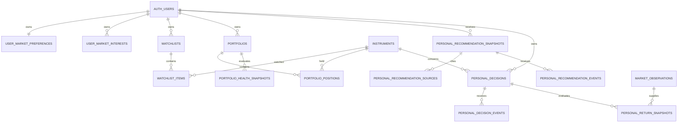

# My Dashboard Contract v1

**Gate:** MYDASH-001 — Product, data and calculation contract  
**Status:** PRODUCER CANDIDATE — IN REVIEW  
**Contract version:** `my-dashboard-contract-v1`  
**Calculation version:** `personal-forward-return-v1`  
**Portfolio Health version:** `portfolio-health-v1`  
**Recommendation version:** `personal-research-relevance-v1`  
**Prepared:** 27 August 2026  
**Production effects:** none — this document proposes later work and does not represent deployed schema or UI

## 1. Product boundary

My Dashboard is an authenticated personal research workspace at `/my-dashboard`. It is not a trading account, financial-advice service, broker connection or permission to move money.

Only permanent Supabase Auth users may enter the workspace. Signed-out and Supabase anonymous users receive a sign-in state containing no personal rows. Existing public Markets, Assessments and Opportunities pages remain the canonical research drill-throughs.

### Route and tabs

The route uses `?tab=<key>` so refresh, direct links, Back/Forward and keyboard focus preserve the selected workspace.

| Order | Key | Tab | Contract |
|---:|---|---|---|
| 1 | `today` | Today | Material changes, stale/missing data, open decisions nearing a checkpoint, portfolio review warnings and new relevant evidence |
| 2 | `recommendations` | Recommendations | Explainable personal research shortlist; never an automatic Buy instruction |
| 3 | `watchlists` | Watchlists | Reuse the owner's existing private lists, notes and ordering |
| 4 | `opportunities` | Opportunities | Long-term themes relevant to watched or held instruments; preserve Opportunity independence |
| 5 | `portfolio-health` | Portfolio Health | Positions, valuation completeness, concentration, allocation, theme/currency exposure and simulated return |
| 6 | `decision-lab` | Decision Lab | Immutable AI-signal and user-paper decisions with forward 5/20/60-session outcomes |

Interaction requirements:

- semantic tablist with Arrow Left/Right, Home/End and visible focus;
- 390 × 844 layouts use a horizontally scrollable tablist without shrinking targets below 44 px;
- each tab has stable loading, signed-out, empty, incomplete-data and error states;
- cards deep-link to `/markets/[symbol]`, `/assessments/[symbol]`, `/opportunities/[theme]`, `/watchlists` or the applicable Strategy page;
- Markets may later expose **Add to watchlist** and **Create paper decision** affordances, but `/markets` remains the canonical public instrument overview;
- no browser calculation becomes authoritative; displayed derived values identify the persisted snapshot and methodology.

## 2. Reuse decision

### Reuse unchanged

| Existing production primitive | Decision |
|---|---|
| `instruments` | Canonical instrument identity |
| `market_observations` | Price, timestamp, provider, interval and adjusted-price evidence |
| `gpt_market_runs` / `gpt_market_assessments` | Immutable AI source and cutoff lineage |
| `market_convergence_assessments` | Independent Technical/AI convergence display source |
| Opportunity tables and exposure mappings | Long-term theme relevance; never converted directly to Buy |
| `watchlists` / `watchlist_items` | Reuse directly; current permanent-user RLS is the model for new owner tables |
| existing public drill-through routes | Reuse by link; do not duplicate full research pages |

### Reference only; do not reuse as the personal ledger

`trading_strategies`, `trading_test_runs` and `trading_decision_evaluations` are strategy-level backtest/paper/live evidence. Current production contains one `backtest` run and one Standard Strategy Review. Their lifecycle, mutable run fields and strategy-level metrics do not match immutable per-decision forward evaluation.

The My Dashboard ledger therefore remains separate. Strategy rows may be linked read-only from Decision Lab, and system decision-tree templates may inform future explanation, but they cannot own, replace or rewrite personal decisions or return snapshots. Existing Strategy RLS also does not contain the explicit anonymous-user rejection used by Watchlists, so it is not the security template for new personal tables.

## 3. Proposed data dictionary

All identifiers are UUID unless stated. All timestamps are `timestamptz`. Every personal row carries `owner_user_id uuid NOT NULL REFERENCES auth.users(id)`. Exact SQL is deferred to the audited migration gate.

### User and portfolio domain

| Table | Required columns and constraints | Browser authority |
|---|---|---|
| `user_market_preferences` | `owner_user_id PK`; `base_currency char(3) DEFAULT 'AUD'`; `default_horizon_days smallint CHECK IN (5,20,60)`; `risk_preference text CHECK IN ('unspecified','conservative','balanced','growth')`; timestamps | Owner SELECT/INSERT/UPDATE; no DELETE required |
| `user_market_interests` | `id PK`; owner; nullable `instrument_id` or `theme_id`, exactly one required; `interest_kind`; timestamps; unique owner/target | Owner CRUD |
| `portfolios` | `id PK`; owner; `name`; `portfolio_kind CHECK IN ('manual','paper')`; `base_currency char(3)`; `status CHECK IN ('active','archived')`; optional `target_allocations jsonb`; timestamps; unique owner/lower(name) among active rows | Owner CRUD |
| `portfolio_positions` | `id PK`; owner; `portfolio_id FK`; `instrument_id FK`; `quantity numeric > 0`; nullable `average_cost_per_unit numeric >= 0`; `cost_currency char(3)`; nullable `acquired_at date`; `source CHECK IN ('manual','paper_decision')`; nullable `source_decision_id`; notes; timestamps; unique portfolio/instrument | Owner CRUD; parent owner must match |

### Recommendation domain

| Table | Required columns and constraints | Browser authority |
|---|---|---|
| `personal_recommendation_snapshots` | `id PK`; owner; instrument; `generated_at`; nullable `valid_until`; `category`; `intended_horizon_days`; thesis; principal risks; confidence; relevance reasons JSON; methodology/model identity; source cutoff; source hash; `data_quality_status`; created timestamp | Owner SELECT only; trusted generator writes |
| `personal_recommendation_sources` | recommendation FK; `source_family`; source table and record ID; source cutoff; methodology; relevance; PK recommendation/family/source ID | Owner SELECT through parent; trusted generator writes |
| `personal_recommendation_events` | `id PK`; owner; recommendation FK; `event_type CHECK IN ('watch','dismiss','feedback','paper_decision')`; event timestamp; optional feedback code/note | Owner SELECT/INSERT only; append-only |

Recommendation snapshots and their source rows are immutable. Dismissal and feedback are new events; they never modify source assessments or prior recommendation evidence.

### Decision and return domain

| Table | Required columns and constraints | Browser authority |
|---|---|---|
| `personal_decisions` | `id PK`; owner; instrument; `source_type CHECK IN ('AI_SIGNAL','USER_PAPER')`; `action CHECK IN ('BUY','WATCH','HOLD','PASS','AVOID')`; horizon 5/20/60; server decision time; source table/ID/hash/cutoff; `entry_rule='NEXT_DAILY_CLOSE'`; state; optional benchmark instrument/mode; unit/notional basis; entry/exit fee and slippage bps; base/instrument currencies; methodology; created timestamp | Owner SELECT; constrained INSERT function only; no UPDATE/DELETE |
| `personal_decision_events` | `id PK`; owner; decision FK; `event_type CHECK IN ('EXIT','CANCEL','NOTE','REVIEW')`; server event time; payload; created timestamp | Owner SELECT; constrained append function only |
| `personal_return_snapshots` | `id PK`; owner; decision FK; checkpoint `OPEN/5D/20D/60D/EXIT`; evaluation time; entry/exit observation IDs/prices; FX and benchmark observation IDs/rates; price, adjusted, base-currency, benchmark, excess and net returns; drawdown; quality state/reasons; calculation version; unique decision/checkpoint/evaluation cutoff | Owner SELECT only; trusted evaluator writes |
| `portfolio_health_snapshots` | `id PK`; owner; portfolio FK; as-of/cutoff; total value/base currency; separate measures JSON; summary state; completeness percentage/reasons; methodology; source hash | Owner SELECT only; trusted evaluator writes |

No table stores broker credentials, order authority or actual trade execution. `live_execution_enabled` is not introduced and existing strategy live execution remains false.

## 4. Relationships



## 5. Security and grants contract

The Watchlist permanent-user predicate is mandatory for every personal table:

```sql
(select auth.uid()) is not null
and coalesce((((select auth.jwt())->>'is_anonymous')::boolean), false) = false
and owner_user_id = (select auth.uid())
```

Rules:

1. Enable RLS before granting browser access.
2. Revoke all privileges from `PUBLIC` and `anon`.
3. Grant `authenticated` only the operations in the dictionary; do not grant full table privileges by default.
4. Owner-managed UPDATE policies require both `USING` and `WITH CHECK`; ownership cannot be reassigned.
5. Child-table policies require both row ownership and matching parent ownership.
6. Immutable snapshots and decisions have no browser UPDATE/DELETE policy.
7. Derived-write functions live in a non-exposed schema where practical, use an empty/safe `search_path`, validate owner and parent identities, and revoke default PUBLIC execution.
8. Prefer security-invoker functions. Any security-definer function requires explicit necessity, internal placement, `auth.uid()`/owner validation where user invoked, restricted EXECUTE and independent audit.
9. Browser code uses only the publishable key. Provider, service-role and vault secrets never enter browser bundles.

### Cross-user test matrix

| Scenario | User A | User B | Anonymous Auth | Signed out |
|---|---:|---:|---:|---:|
| Read own preferences/portfolio/watchlist | Allow | Allow | Deny | Deny |
| Read another owner's personal row by direct ID | Deny | Deny | Deny | Deny |
| Insert row claiming another owner | Deny | Deny | Deny | Deny |
| Change `owner_user_id` | Deny | Deny | Deny | Deny |
| Add child to another owner's parent | Deny | Deny | Deny | Deny |
| Update/delete immutable decision or snapshot | Deny | Deny | Deny | Deny |
| Read public Markets/Assessments/Opportunities | Allow | Allow | Existing public contract | Existing public contract |
| Call derived-write helper directly | Deny unless constrained owner RPC | Deny unless constrained owner RPC | Deny | Deny |

MYDASH-002 must test two permanent identities and one anonymous/signed-out session against every new exposed table and RPC.

## 6. Recommendation contract

A recommendation is a research-relevance snapshot with one of these categories:

- `INVESTIGATE` — sufficiently strong, current, independent evidence warrants deeper research;
- `MONITOR` — relevant but not yet supported strongly enough;
- `REVIEW_RISK` — a watched/held instrument has a material risk or adverse evidence change;
- `THEME_EXPOSURE` — explains a long-term Opportunity connection without a short-term action label.

Eligibility requires all of:

1. personal relevance from a watchlist, portfolio position or explicit interest;
2. a current qualifying source with immutable ID, cutoff and methodology;
3. at least two independent evidence families for `INVESTIGATE` or `REVIEW_RISK`;
4. explicit principal risk and missing-data disclosure;
5. source freshness appropriate to the intended horizon.

Sources remain separated on the card:

- short-term independent Market;
- Technical/Market Convergence;
- long-term Opportunity;
- sourced company/market evidence where persisted.

Exclusions:

- Opportunity score alone;
- one technical indicator;
- short-term price momentum alone;
- unsupported model opinion;
- failed/partial source without disclosed limitation;
- stale evidence outside its approved horizon;
- missing source identity/cutoff/methodology;
- inferred Buy/Sell from a blended score.

The UI never labels a personal recommendation **Buy**. BUY is an explicit AI-source or user-paper decision captured separately in Decision Lab. Feedback affects future relevance ranking only through a versioned methodology and never rewrites historical snapshots.

## 7. Portfolio Health contract

Portfolio Health exposes dimensions, not one opaque score.

| Dimension | Measure | Advisory / review thresholds |
|---|---|---|
| Position concentration | position value / complete portfolio value | Advisory >15%; Needs review >25% |
| Top-three concentration | three largest positions / complete value | Advisory >45%; Needs review >60% |
| Issuer concentration | combined value for same issuer | Advisory >20%; Needs review >30% |
| Asset allocation | value by asset type; compare user targets when defined | Advisory drift >5 percentage points; Needs review >10 |
| Theme exposure | value of positions mapped to each theme; overlapping themes shown separately | Advisory >35%; Needs review >50% |
| Currency exposure | value by instrument currency in base currency | Non-base advisory >35%; Needs review >50% |
| Watchlist overlap | held instruments also watched | Informational only |
| Data freshness | age of required price/FX observation by market session | Advisory after one eligible session; Needs review after two |
| Cost-basis completeness | positions with valid quantity/cost/currency | Missing values block unrealised-return claims |
| FX completeness | non-base value with timestamp-aligned FX | Missing FX blocks total/base-currency allocation |
| Target drift | current versus user-defined allocation target | no target means `NOT_CONFIGURED`, not zero drift |

Summary state:

- `INCOMPLETE_DATA` when required price, FX, quantity or mapping evidence prevents complete valuation;
- otherwise `NEEDS_REVIEW` when any review threshold is crossed;
- otherwise `HEALTHY`.

Every contributing value and threshold remains visible. These are transparent concentration/data-quality warnings, not regulatory suitability or personal risk advice.

## 8. Decision clocks and entry resolution

### AI signal

- source: immutable `gpt_market_assessments` row from a terminal eligible run;
- decision time: `gpt_market_runs.analysis_cutoff_time`;
- no fallback to a later timestamp when the authoritative cutoff is absent;
- source snapshot stores assessment ID, run ID, cutoff, rating/score/confidence, methodology/model and a canonical hash.

### User paper decision

- source: explicit owner action;
- decision time: trusted server/database `clock_timestamp()`, never a client-supplied backdate;
- source snapshot stores the evidence visible to the user and its cutoffs at that time.

Both use `NEXT_DAILY_CLOSE` in v1: the first eligible `1day` observation strictly after that decision's own timestamp. The clocks remain distinct; identical entry must never be assumed. If no qualifying observation exists, state is `PENDING_ENTRY`.

BUY decisions receive return scoring. WATCH, HOLD, PASS and AVOID preserve the subsequent observed market move for learning but are labelled observational; they are not treated as short positions or simulated profit.

## 9. Return methodology

Let entry price be (P_0), checkpoint price (P_t), and all rates be decimals.

### Price return

```text
price_return = (P_t / P_0) - 1
```

### Trading-session horizons

For one instrument, order eligible daily observations after the entry observation. The 5D, 20D and 60D checkpoints are the fifth, twentieth and sixtieth later eligible observations, not wall-clock days. `OPEN` uses the latest eligible observation and remains provisional.

### Fees and slippage

Assumptions are stored on the decision. V1 defaults may be explicit zeroes, but the UI must display them.

For unit notional (N), entry fee (f_0), exit fee (f_t), entry slippage (s_0) and exit slippage (s_t):

```text
units = N * (1 - f_0) / (P_0 * (1 + s_0))
proceeds = units * P_t * (1 - s_t) * (1 - f_t)
net_simulated_return = (proceeds / N) - 1
```

Market return and net simulated return are stored and labelled separately.

### Base-currency return

Let (q_0) and (q_t) be base-currency units per instrument-currency unit from timestamp-aligned FX observations:

```text
base_currency_return = ((P_t * q_t) / (P_0 * q_0)) - 1
```

Production currently has usable AUD/USD and other FX histories, but v1 verification is limited to direct or inverse pairs with persisted observations. For a USD instrument and AUD base, (q = 1 / AUDUSD). No triangulated or stale FX rate is fabricated.

### Benchmark and excess return

Benchmark is optional and must be either owner-selected or supplied by a separately approved mapping. No asset-type default is inferred merely because QQQ exists.

```text
benchmark_return = (B_t / B_0) - 1
excess_return = comparable_instrument_return - benchmark_return
```

If benchmark entry/exit observations are not aligned to the evaluated sessions, benchmark and excess return remain NULL with `MISSING_BENCHMARK`.

### Drawdown

For persisted valuation sequence (V_0 ... V_t):

```text
drawdown_i = (V_i / max(V_0 ... V_i)) - 1
maximum_drawdown = min(drawdown_i)
```

The UI presents the absolute percentage loss while the stored signed value remains non-positive.

### Adjusted prices and corporate actions

Production stores Tiingo raw OHLC separately from `adjusted_close`, and current daily coverage contains adjusted values. MYDASH-001 does not claim that those values provide verified total return for every asset/provider. Initial results calculate raw closing-price return. Adjusted/total return remains NULL/`UNVERIFIED_CORPORATE_ACTIONS` until provider semantics, split/dividend handling and cross-provider consistency pass an independent methodology test.

### Data-quality states

`PENDING_ENTRY`, `PENDING_HORIZON`, `COMPLETE_PRICE_ONLY`, `COMPLETE_BASE_CURRENCY`, `INCOMPLETE_FX`, `MISSING_BENCHMARK`, `STALE_SOURCE`, `UNVERIFIED_CORPORATE_ACTIONS`, `MAPPING_REQUIRED`, `CALCULATION_ERROR`.

Missing values remain NULL and carry reasons; they are never converted to zero.

## 10. Determinism and versioning

- immutable decision/source hash;
- immutable selected entry observation;
- unique decision/checkpoint/evaluation-cutoff key;
- calculation version `personal-forward-return-v1`;
- same inputs and version must produce byte-equivalent numeric outputs;
- reruns upsert the same logical checkpoint only when source identity matches;
- a method change creates a new calculation version and snapshot, never rewrites prior results;
- all decimal rounding occurs only for presentation; database calculations retain numeric precision;
- source queries are bounded by persisted decision/checkpoint cutoffs, preventing look-ahead.

## 11. Migration plan

| Gate | Proposed migration / application work | Stop condition |
|---|---|---|
| MYDASH-002 | preferences, interests, secure dashboard shell, Today read model, permanent-user RLS and minimum grants | Cross-user and anonymous tests pass |
| MYDASH-003 | reuse Watchlists and Opportunity mappings; no new Buy logic | Relevance and missing-data states pass |
| MYDASH-004 | portfolios, positions and health snapshots/evaluator | Owner Review B |
| MYDASH-005 | recommendation snapshots, sources and append-only events | Provenance/exclusion audit passes |
| MYDASH-006 | decisions and decision events; constrained immutable capture functions | AI/user clock audit passes |
| MYDASH-007 | return snapshots, internal evaluator/queue, benchmark/FX/corporate-action states | Owner Review C with real forward pilot |
| MYDASH-008 | documentation reconciliation, user guide, accessibility, performance and temporary-helper removal | Final audit |

Each schema gate uses one committed migration, updates `documentation/supabase-data-model.md` only after production truth matches, and runs Supabase security/performance advisors.

## 12. Operational jobs

ChatGPT is not the arithmetic engine.

Proposed v1 operations:

1. existing market-history daily-close enqueue remains at 06:30 AWST;
2. a deterministic return-evaluation enqueue may run at 07:00 AWST after MYDASH-007 approval;
3. an idempotent worker resolves pending entries/checkpoints and writes return snapshots;
4. portfolio health refresh follows successful price/FX evaluation or an owner position change;
5. failures persist retry count, exact error and data-quality state;
6. no job invokes a broker, places an order or changes a portfolio position.

The 07:00 proposal is not deployed by this gate and remains subject to owner and independent audit.

## 13. Current evidence and limitations

Read-only production inspection at 27 August 2026 12:06 AWST found:

- schema fingerprint `63807c58a0ec0403ad060a49a70a11e8`;
- latest migration `20260827003047 repair_external_opinion_canonical_deduplication`;
- 3 permanent Auth users and 0 anonymous Auth users;
- 1 strategy, 1 backtest run and 1 decision evaluation;
- no proposed My Dashboard personal-domain table exists;
- 90,318 daily and 8,788 quote observations across equity, ETF, crypto and forex;
- every inspected observation currently has `adjusted_close`, but semantic verification remains outstanding;
- latest persisted Market run completed 21 August 2026 00:56 UTC;
- latest Opportunity run completed 26 August 2026 05:01 UTC;
- latest Convergence run completed 22 August 2026 05:55 UTC.

Known limitations requiring later evidence:

- no production personal portfolio/decision/recommendation rows;
- no approved universal benchmark mapping;
- FX conversion outside direct/inverse persisted pairs is unsupported;
- corporate-action/total-return semantics are not yet verified;
- no historical replay is authorised;
- current Strategy tables are not semantically or security-equivalent to the proposed personal ledger.

## 14. Acceptance mapping

| MYDASH-001 requirement | Candidate evidence |
|---|---|
| final route and six tabs | Sections 1 |
| existing reuse inventory | Section 2 |
| exact data dictionary and relationships | Sections 3–4 |
| RLS, grants and cross-user matrix | Section 5 |
| recommendation provenance/exclusions | Section 6 |
| Portfolio Health definitions | Section 7 |
| separate decision clocks | Section 8 |
| entry/horizon/fees/slippage/FX/benchmark/corporate action | Sections 8–9 |
| deterministic formulae/versioning/incomplete states | Sections 9–10 |
| migration and operational jobs | Sections 11–12 |
| no production changes | Header and Section 13 |

The independent Auditor must verify this contract against the exact GitHub identities and Supabase fingerprint, reproduce representative formulas from persisted observations without writes, and either issue one complete correction set or route the passed candidate to Owner Review A.
