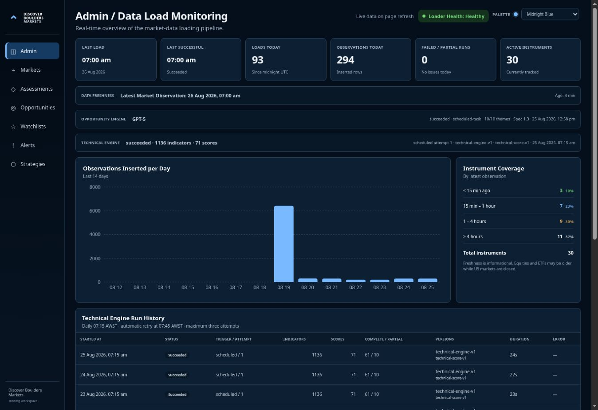
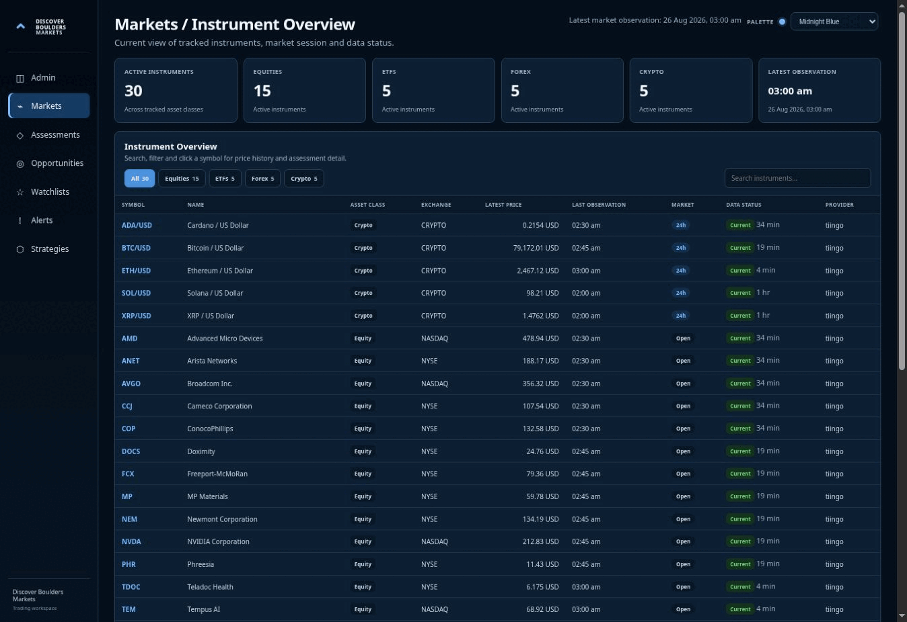
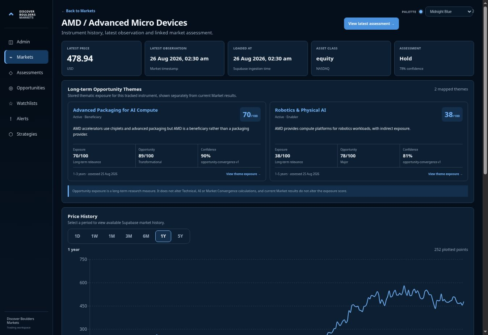
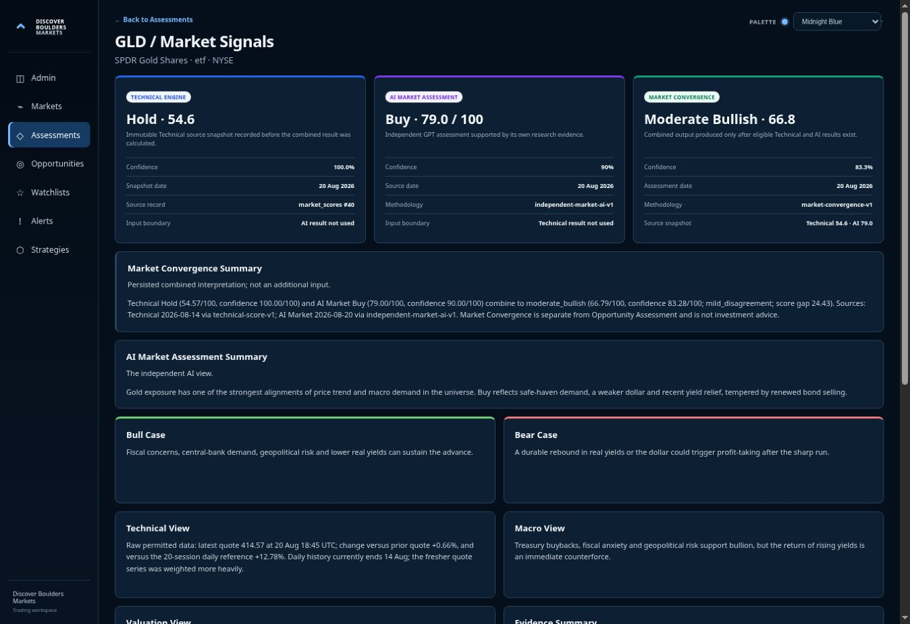
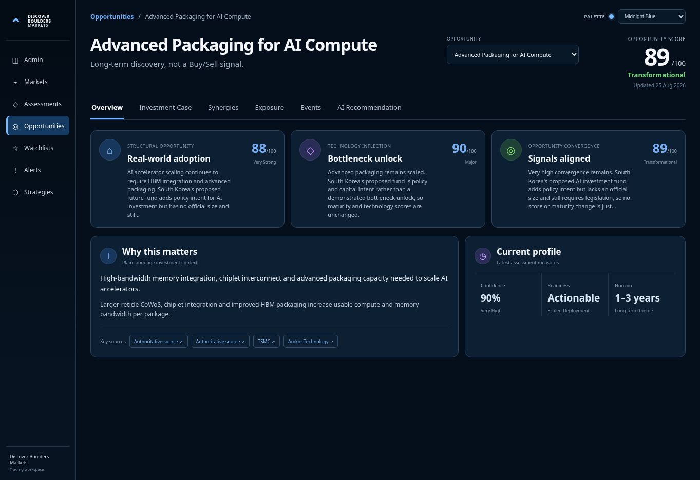

# Discover Boulders Markets — User Guide

**Production:** https://discoverbouldersmarkets.vercel.app  
**Audience:** first-time users with general market knowledge  
**Guide status:** public research, private monitoring, Strategy interpretation and operational support documented; final mobile evidence capture and publication QA remain  
**Last production check:** 26 August 2026

## Before you begin

Discover Boulders Markets is a research and monitoring platform. It does **not** place live trades, and its dashboards are not personalised financial advice.

Keep these boundaries in mind:

- **Market Assessment** asks whether a tracked instrument appears attractive now.
- **Opportunity Assessment** asks what structural or technological themes could become important over months or years.
- **Technical Engine** and **AI Market Assessment** are produced independently.
- **Market Convergence** combines eligible Technical and AI results only after both exist.
- A long-term Opportunity score is not a Buy recommendation.
- Strategy results are test evidence, not permission to trade. The current reviewed strategy outcome is `VALIDATE_ROBUSTNESS / continue_testing`, with live execution disabled.

## Access at a glance

Most research dashboards are public and read-only. Personal monitoring and strategy evidence require a permanent Supabase Auth account.

| Workspace | Route | Access | What it is for |
|---|---|---|---|
| Admin | `/admin` | Public operational view | Loader health, data freshness and engine telemetry |
| Markets | `/markets` | Public read-only | Browse tracked instruments and current data status |
| Instrument detail | `/markets/[symbol]` | Public read-only | Review price history, latest Market result and linked Opportunity themes |
| Assessments | `/assessments` | Public read-only | Compare independent Technical and AI results with Market Convergence |
| Assessment detail | `/assessments/[symbol]` | Public read-only | Inspect scores, confidence, disagreement, lineage, catalysts, risks and evidence |
| Opportunities | `/opportunities` | Public read-only | Browse long-term themes and current Opportunity scores |
| Opportunity detail | `/opportunities/[theme]` | Public read-only | Review Structural, Technology and Opportunity Convergence evidence |
| Watchlists | `/watchlists` | Signed-in owner | Maintain private instrument lists |
| Alerts | `/alerts` | Signed-in owner | Maintain private alert definitions and inspect event history |
| Strategies | `/strategies` | Signed-in owner | Review private strategy definitions, tests and decision outcomes |

Opening the production root currently lands on the Admin dashboard. Use the persistent left navigation to move between workspaces.

## Recommended first visit

Use this order to understand the platform without mixing short- and long-term signals:

1. Open **Admin** and check loader health and data freshness.
2. Open **Markets** and choose a tracked instrument.
3. Use the instrument page to review current observations and any linked Opportunity themes.
4. Open **Assessments** and compare Technical, AI and Market Convergence results for that instrument.
5. Open **Opportunities** to research long-term themes separately.
6. Sign in only when you need private Watchlists, Alerts or Strategy evidence.
7. Treat every score as research evidence that still requires your own judgement.

## 1. Check platform and data health

**Primary routes:** `/`, `/admin`, `/admin/loads/[id]`  
**Access:** public and read-only

Use Admin before interpreting time-sensitive results. The page refreshes its evidence when loaded; it does not provide controls to start, retry or alter a pipeline.

### Read the dashboard from top to bottom

1. **Loader Health** summarises current ingestion. **Healthy** means a load record exists, there are no failed/partial runs counted today, and the latest observation is not beyond the dashboard's 90-minute warning threshold. **Warning** means at least one of those checks needs attention. **No data** means the dashboard has no load record to assess.
2. Compare **Last Load** with **Last Successful**. A newer load can be running, partial or failed even when an older successful time remains visible.
3. Read **Failed / Partial Runs** with **Requested**, **Received** and **Inserted** counts in Recent Load History. A successful invocation does not guarantee every instrument is current.
4. Check **Data Freshness** and **Instrument Coverage**. The coverage bands—under 15 minutes, 15–60 minutes, 1–4 hours and over 4 hours—describe age only. They are not a universal buy/sell or availability signal.
5. Check the **Opportunity Engine** terminal status, execution source, completed/requested themes, model and specification version.
6. Check the **Technical Engine** terminal status, trigger/attempt, indicator and score counts, complete/partial scores, methodology versions, duration and any error.
7. Select a timestamp in **Recent Load History** to open `/admin/loads/[id]`. The detail page shows the exact run summary, loader metadata and observations loaded around that run.

*The public Admin view is the first operational checkpoint. Values change on refresh; read the labels and timestamps rather than treating this captured snapshot as current forever.*

Historical Tiingo `1day` data is research/backtest input and must not be mistaken for a current Twelve Data `quote`. Older US equity or ETF observations may be expected while that market is closed; crypto and forex are normally continuously eligible.

## 2. Browse markets and open an instrument

**Primary routes:** `/markets`, `/markets/[symbol]`  
**Access:** public and read-only

Use the left navigation on any page to open **Markets**. The active workspace is highlighted, and the same navigation takes you to Assessments and Opportunities without requiring sign-in.

### Find an instrument

1. Check **Latest market observation** before using any displayed price.
2. Use an asset-class filter—All, Equities, ETFs, Forex or Crypto—or enter a symbol/name in **Search instruments**.
3. Read the row across: symbol, asset class, exchange, latest price, observation time, market state, data status and provider.
4. Treat **Market Closed** as different from **Stale**. A closed US equity/ETF session can legitimately have an older observation; stale data during an active session needs caution.
5. Select the symbol to open its detail page.

*The Markets overview is the public starting point for choosing an instrument and checking whether its latest observation is current enough to interpret.*

### Read the instrument page

Read from the top down:

1. **Latest price**, **Latest observation** and **Loaded at** establish what the displayed market value is and when it entered the platform.
2. **Assessment** is the latest short-term AI Market rating and confidence available for the instrument. Use **View latest assessment** to inspect its sources and the separate Technical and Convergence results.
3. **Long-term Opportunity Themes** lists only stored thematic exposures. Read **Exposure** as relevance/materiality to the theme and **Opportunity** as the theme's long-term score; neither predicts the instrument's near-term return.
4. Use the period controls above **Price History** to change the visible history window.
5. Use **Recent Observations** to inspect the timestamped underlying rows rather than assuming the chart is a live quote.

*The instrument page deliberately presents the current Market result separately from long-term Opportunity exposure; one must not be used as a substitute for the other.*

## 3. Read a Market Assessment: Technical, AI and Market Convergence

**Primary routes:** `/assessments`, `/assessments/[symbol]`  
**Access:** public and read-only

Open **Assessments** from the left navigation. The overview first reports three distinct persisted populations—Technical Engine source snapshots, AI Market Assessments and Market Convergence results—then shows the latest assessment set, rating distribution and a row-by-row comparison. Select an instrument to inspect its exact source dates, methodology and evidence.

On the detail page, read the three cards in this order:

1. **Technical Engine** — a deterministic 0–100 score derived from eligible persisted market indicators. Its confidence measures intended input coverage, not the probability of a future return. The card identifies the immutable source row and states that the AI result was not used.
2. **AI Market Assessment** — an independent research rating, 0–100 score and confidence supported by its own market evidence, catalysts and risks. The card states that the Technical result was not used.
3. **Market Convergence** — the versioned downstream combination produced only when both eligible branches exist. The current methodology gives the two scores equal weight, snapshots their lineage and reduces/caps confidence when the branches disagree.

Do not read only the combined number. Compare:

- assessment and source dates;
- the two independent scores and confidence values;
- methodology versions and source IDs;
- the disagreement label and score gap in the Convergence summary;
- the AI bull case, bear case, evidence and risks.

If an eligible source branch is missing or stale under the convergence contract, the system must not invent a neutral value or copy the available branch. A **Mixed** or **Conflict** result is useful evidence of disagreement, not an error to ignore.

*The assessment detail keeps the two independent inputs and their downstream Convergence result visible together, including dates, confidence, methodology and disagreement context.*

## 4. Research long-term Opportunities

**Primary routes:** `/opportunities`, `/opportunities/[theme]`  
**Access:** public and read-only

Open **Opportunities** for multi-month and multi-year research. The overview shows the latest run status, assessed-theme coverage, score changes, newly recorded events and one card per active/watch theme. A theme card includes its current Opportunity score/level, latest-update state, short description and highest stored public-market exposures.

Select **Open opportunity** to read a theme. The detail page separates six views:

- **Overview** — independent Structural, Technology and Opportunity Convergence cards plus the current profile;
- **Investment Case** — the longer-form thesis and risk context;
- **Synergies** — relationships with other themes;
- **Exposure** — tracked and external listed entities ranked by theme relevance;
- **Events** — material Technology Inflection evidence;
- **AI Recommendation** — the persisted long-term research conclusion and supporting explanation.

Read the Overview cards independently:

1. **Structural Opportunity** evaluates demand, adoption, capital investment, capacity constraints and economics.
2. **Technology Inflection** evaluates bottleneck removal, evidence quality, commercialisation and impact, including the maturity stage.
3. **Opportunity Convergence** combines the completed Structural and Technology scores. Confidence is assessed separately and must account for disagreement, freshness and evidence independence.

*The Opportunity detail presents the two independent long-term signals before their combined score, with confidence, readiness and time horizon shown separately.*

A high Opportunity score means the theme deserves long-term research attention. It is not a Buy/Sell signal. An exposure score means an instrument or external listing is relevant to the theme; it is not expected return or short-term conviction. Return to **Markets** or **Assessments** when you need the independent current instrument view.

## 5. Maintain private Watchlists

**Primary route:** `/watchlists`  
**Access:** signed-in permanent owner account

Watchlists are private Supabase Auth workspaces protected by owner-scoped row-level security. The public Markets, Assessments and Opportunities dashboards remain available without signing in.

### Sign in safely

1. Open **Watchlists**, enter the email address for your permanent account and choose **Send secure sign-in link**.
2. Open the link only from the inbox for that account. Do not share the link, a session, or account credentials.
3. Return to `/watchlists`. A signed-in workspace shows your own lists and a **Sign out** control. An anonymous session is not accepted as an owner.

Watchlist names, descriptions, private notes, order and instrument membership belong to the signed-in owner. V1 has no shared, team or public watchlists, and another account cannot read or change them.

### Create and maintain a list

1. Under **Create a watchlist**, enter a required name and an optional description, then choose **Create watchlist**. Your first list becomes the default automatically.
2. Choose a list under **Your lists**. Use **List details** and **Save details** to rename it or change the description.
3. For a non-default list, choose **Make default** when you want it selected first.
4. Under **Add an instrument**, choose an active tracked instrument and select **Add**. An instrument can appear only once in the same list.
5. Add or revise **Private notes**; leaving the field saves a changed note. Use the up/down controls to change display order or **Remove** to remove only that instrument.
6. Choose **Delete list** only when the confirmation is intentional: the list and all of its items are removed.

An empty list or an account with no lists is a valid state. A Watchlist organises monitoring; its membership or notes do not create an alert, place a trade, or express a platform recommendation.

> **AUTH_REQUIRED — owner screenshot:** On 26 August 2026 the current production browser had no already-authorised permanent-owner session. The signed-out `/watchlists` boundary was verified, but `watchlists-owner-desktop.png` was not captured. The owner workflow above was verified against current application source, the implemented access contract and read-only production RLS evidence; no private row or identity was exposed.

## 6. Configure Alerts and review event history

**Primary route:** `/alerts`  
**Access:** signed-in permanent owner account

Alerts use the same permanent identity as Watchlists. Alert definitions and event history are private to their owner. An alert is a monitoring event, not an order and not a guarantee that a condition will remain true.

### Create an alert

1. Open **Alerts**. If signed out, use **Send secure sign-in link** with the same permanent account used for Watchlists.
2. Enter a name and choose an alert type.
3. Choose the permitted target: an instrument or one of your Watchlists for short-term types, or an Opportunity theme for **Opportunity Assessment**.
4. Complete the condition shown for that type. Score-based conditions use a threshold and **Crosses above/below**; state or label conditions use **Enters** or **Any change**. Assessment types can also require a minimum confidence.
5. Choose **Create alert**. The evaluator first establishes a baseline, so a condition that was already true before creation does not produce historical events.

The six available types have deliberately separate meanings:

- **Price threshold** — a stored price crosses the configured value in the instrument currency.
- **Market-data freshness** — eligible data enters Due, Stale or No observation; a closed US equity/ETF session is not treated as stale merely because its last observation is older.
- **Market Assessment** — the independent AI rating changes/enters a selected value, or its score crosses a threshold.
- **Opportunity Assessment** — a long-term theme's level, score or commercial-readiness state changes as configured.
- **Market Convergence** — the persisted combined Technical/AI label changes/enters a selected value, or its score crosses a threshold.
- **Technical score** — a completed independent Technical metric crosses a threshold.

### Maintain definitions

- Choose **Edit**, change the definition and save it when the target or condition needs revision.
- Use **Disable** to stop evaluation without deleting the definition. Re-enabling establishes a fresh baseline.
- Choose **Delete** only after checking the confirmation; deletion also removes that alert's event history.
- A Watchlist-target alert can use only a list owned by the same signed-in account.

Crossing and entry alerts fire on a new transition, not on every later observation while the condition remains true. They re-arm only after the source crosses back or leaves the selected state. Retrying the same source transition cannot create a duplicate event.

### Read event history

**Event history** is read-only, system-generated evidence. Each visible entry identifies the related alert, trigger time, message or event key, the numeric/current value when applicable, notification status and source table. Use the source and timestamp to understand why it fired; do not treat the event as a current quote.

V1 records events before any outbound delivery and normally shows `not_requested`. That status means no email, SMS or push delivery was requested—it is not proof that a notification was sent. **No alert events have fired yet** is a valid empty state.

> **AUTH_REQUIRED — owner screenshot:** On 26 August 2026 the current production browser had no already-authorised permanent-owner session. The signed-out `/alerts` boundary was verified, but `alerts-owner-desktop.png` was not captured. The definition and event-history workflow above was verified against current application source, the alert lifecycle contract and read-only production RLS/schema evidence; no alert, event, private identity or invented state was shown.

## 7. Review Strategy evidence

**Primary routes:** `/strategies`, `/strategies/[id]`, `/strategies/[id]/tests/[runId]`  
**Access:** signed-in permanent owner account

The Strategy laboratory shows owner-scoped, versioned strategy definitions, real test evidence, immutable provenance and persisted Standard Strategy Review outcomes. It does not run a backtest from the browser, change a decision, place an order or enable live trading.

### Read a Strategy result

1. Confirm the strategy code, version and lifecycle status. **Testing** means the strategy is still under research.
2. Read **Live trading** independently of the test result. It must say **Disabled** for the current baseline.
3. Confirm the run is a terminal **Succeeded** backtest and read its period, instrument and completed-trade counts.
4. Compare total return with **Out-of-sample** return. The current Daily Trend Pullback v1 baseline has 249 completed trades and a positive 28.22% total return, but its persisted one-year out-of-sample return is -8.27%.
5. Read supporting risk/quality metrics together: profit factor 1.323, positive expectancy, 16.29% maximum drawdown and Sharpe ratio 0.585. No single favourable metric overrides the holdout failure.
6. Follow the ordered **Standard Strategy Review** path. The current run passes minimum trades, expectancy, profit factor and drawdown, then fails the positive out-of-sample gate.
7. Read the persisted outcome exactly: `VALIDATE_ROBUSTNESS / continue_testing`. This is a request for more robustness evidence, not promotion, approval or permission to trade.
8. Open **Evidence and provenance** when you need the engine, ingestion contract, metric-definition version, immutable strategy snapshot and completion time. If a succeeded run has no persisted evaluation, the UI correctly shows **Review pending** rather than inferring an outcome.

Never hide the negative holdout, substitute a favourable period or equate a backtest with future performance. Strategy evidence remains private to its owner and is not personalised advice.

> **AUTH_REQUIRED — Strategy screenshot:** On 26 August 2026 the production browser had no already-authorised permanent-owner session. The signed-out `/strategies` boundary was verified, but `strategy-result-desktop.png` was not captured. This applies to `/strategies`, `/strategies/[id]` and `/strategies/[id]/tests/[runId]` owner evidence. The workflow and immutable baseline were verified against current source, canonical review documents and read-only production records; no owner identity, private row or invented screenshot was used.

## 8. Understand freshness, statuses and empty states

A truthful dashboard may show older, missing or empty data. Do not substitute another interval or source merely to make a page appear current.

### Freshness and session labels

- **Current** — live quote age is within 90 minutes.
- **Due** — live quote age is 91–120 minutes; treat it as aging and recheck before relying on it.
- **Stale** — live quote is older than 120 minutes while the instrument is expected to be active.
- **Market Closed** — an older US equity/ETF quote is explained by the configured closed session; it is not relabelled stale merely because time passed.
- **No Observation** — the platform has no eligible live quote to show. A blank price is more truthful than a historical substitute.
- Technical, Market AI, Market Convergence and long-term Opportunity workflows each have their own source and freshness contracts. Do not use one branch's timestamp to declare another current.

### Status colours

Colour is supporting emphasis, never the sole meaning:

- green accompanies healthy, succeeded or promoted/approved states;
- amber accompanies warning, partial, testing, `continue_testing`, revise, draft or monitoring states;
- red accompanies failed, rejected, paused or retired states;
- blue accompanies a running state.

Always read the visible status word, timestamp, error and counts. Palette selection can alter appearance without changing the persisted status.

### Valid empty states

These states require investigation or patience, not invented content:

- no load, Technical Engine or assessment history is visible yet;
- a Strategy has no real test run, or a succeeded run has no persisted review;
- the signed-in account owns no Watchlists, Alerts or Strategy evidence;
- no alert events have fired;
- an instrument has no current quote, eligible assessment or Opportunity exposure.

### Common troubleshooting

1. **Start at Admin and refresh once.** Confirm Loader Health, Last Load, Last Successful, latest observation age and terminal engine statuses.
2. **If a price looks old, check asset class and market session.** Use the Markets status label and observation timestamp; do not use daily history as a live quote.
3. **If a load is partial or failed, open its timestamp.** Compare requested, received and inserted counts, eligibility/skipped metadata and the exact error. Ordinary users should report that evidence rather than attempt a privileged retry.
4. **If an assessment or Convergence result is missing, check its source branches and dates.** The platform deliberately avoids manufacturing a neutral result when required evidence is absent.
5. **If private content is empty, confirm the permanent owner account.** Row-level security intentionally hides another owner's Watchlists, Alerts, events and Strategy evidence.
6. **If alert history is empty, check that the definition is enabled and has established a baseline.** Alerts fire on a new transition; they do not backfill a condition that was already true.
7. **If a route or dashboard fails, record the exact route, visible error and time.** A GitHub commit, Vercel deployment and production behaviour are separate evidence layers; do not call the platform recovered until the affected production route works on a READY deployment.

### Use the platform on a narrow screen

At widths up to 900 pixels, the side navigation becomes a horizontally swipeable rail. At smaller breakpoints, page headers stack, material controls retain a 44-pixel touch target, and wide tables stay inside their own horizontal scroll area. Swipe the navigation or table itself; page-level sideways scrolling is not expected. The palette selector remains available and does not change the data or status semantics.

> **CAPTURE_REQUIRED — mobile evidence:** The responsive contract and current source were verified, but the available production browser exposed only a fixed 1363 × 936 CSS-pixel viewport. `markets-overview-mobile.png` was therefore not captured or counted. A true narrow production capture is still required; a desktop crop or relabelled image must not be substituted.

### Compact glossary

| Term | Meaning |
|---|---|
| Live quote | Current-dashboard observation on the Twelve Data `quote` path; not Tiingo daily history. |
| Observation time | When the market value applies; distinct from when the row was loaded. |
| Loaded at | When the platform ingested the observation. |
| Market Assessment | Short-term, instrument-level AI research for the current assessment date. |
| Technical Engine | Independent deterministic indicators and scores from persisted market history. |
| Market Convergence | Versioned downstream combination of eligible Technical and AI Market inputs. |
| Opportunity Assessment | Long-term theme research kept separate from short-term price and Market signals. |
| Confidence | Method-specific evidence/coverage strength; not a probability of profit. |
| Exposure score | How materially an instrument is connected to an Opportunity theme; not a return forecast. |
| Baseline | The first observed alert state; it prevents retrospective events. |
| Rearm | An alert becomes eligible again only after its source leaves/crosses back from the triggering state. |
| `continue_testing` | Persisted Strategy action requesting more robustness evidence; not promotion or live-trading approval. |
| RLS | Row-level security that limits private workspace rows to their authenticated owner. |
| READY deployment | Vercel finished the build successfully; the production alias and route still require verification. |

## Screenshot evidence manifest

The final guide targets seven to nine production screenshots. Every image must use real production-backed state, omit personal information, have meaningful alt text and include a concise explanatory caption. Five images are currently delivered. Items 5–7 remain blocked by `AUTH_REQUIRED`, and item 9 remains `CAPTURE_REQUIRED`; absent files are not counted.

| # | Planned filename | Gate | Route/state | Access | Intended teaching purpose |
|---|---|---|---|---|---|
| 1 | `markets-overview-desktop.png` | UGUIDE-002 | `/markets` | Public | Navigation, filters, instrument table and freshness |
| 2 | `instrument-detail-desktop.png` | UGUIDE-002 | Representative `/markets/[symbol]` | Public | Price history, current result and separate Opportunity exposure |
| 3 | `assessment-detail-desktop.png` | UGUIDE-002 | Representative `/assessments/[symbol]` | Public | Distinct Technical, AI and Market Convergence cards |
| 4 | `opportunity-detail-desktop.png` | UGUIDE-002 | Representative `/opportunities/[theme]` | Public | Structural, Technology and Opportunity Convergence separation |
| 5 | `watchlists-owner-desktop.png` | UGUIDE-003 | `/watchlists`, owner state | Authenticated owner | Private list creation and instrument membership |
| 6 | `alerts-owner-desktop.png` | UGUIDE-003 | `/alerts`, owner state | Authenticated owner | Private alert definition and event history |
| 7 | `strategy-result-desktop.png` | UGUIDE-004 | Representative strategy test result | Authenticated owner | Metrics, review path and `continue_testing` outcome |
| 8 | `admin-health-desktop.jpg` | UGUIDE-004 | `/admin` | Public | Loader health, freshness and run telemetry |
| 9 | `markets-overview-mobile.png` | UGUIDE-004 | `/markets` narrow viewport | Public | Mobile navigation and responsive market table pattern |

If an authorised owner session is unavailable for items 5–7, the affected gate records `AUTH_REQUIRED` rather than using a sign-in form or invented private state. UGUIDE-003 recorded this for `/watchlists` and `/alerts`; UGUIDE-004 records it for the Strategy route family. A true narrow production viewport is still required for item 9, so its absent file remains `CAPTURE_REQUIRED`.

## Section-to-source map

This map identifies the canonical evidence that controls each section. The final prose should remain task-focused; these technical sources are for verification and deeper reading.

| Guide section | Production routes | Canonical documentation |
|---|---|---|
| Orientation, navigation and access | `/`, all primary navigation routes | [Frontend route map](frontend-route-map.md), [Platform architecture](platform-architecture.md), [Assessment system overview](assessment-system-overview.md) |
| Admin and freshness | `/admin`, `/admin/loads/[id]` | [Operational runbook](operational-runbook.md), [Market data pipeline](pipelines/market-data-pipeline.md), [Technical Engine operations](pipelines/technical-engine-operations.md) |
| Markets and instrument detail | `/markets`, `/markets/[symbol]` | [Frontend route map](frontend-route-map.md), [Market data pipeline](pipelines/market-data-pipeline.md), [Assessment system overview](assessment-system-overview.md) |
| Technical, AI and Market Convergence | `/assessments`, `/assessments/[symbol]` | [Assessment system overview](assessment-system-overview.md), [Technical scoring specification](specifications/technical-market-scoring-specification.md), [Market Convergence specification](specifications/market-convergence-specification.md) |
| Long-term Opportunities | `/opportunities`, `/opportunities/[theme]` | [Assessment system overview](assessment-system-overview.md), [Opportunity pipeline](pipelines/opportunity-assessment-pipeline.md), [Daily Opportunity specification](../automation/daily-opportunity-assessment.md) |
| Watchlists | `/watchlists` | [Watchlist access model](security/watchlist-auth-model.md), [Watchlist activation](watchlist-activation.md) |
| Alerts and event history | `/alerts` | [Alert trigger specification](specifications/alert-trigger-specification.md), [Alert lifecycle](alert-lifecycle.md) |
| Strategies | `/strategies` and detail routes | [Strategy framework](strategy-framework.md), [Baseline result](backtests/daily-trend-pullback-v1-baseline-result.md), [Standard review](strategy-reviews/daily-trend-pullback-v1-standard-review.md) |

## Verification inventory for later gates

Production was observed at a 1363 × 936 CSS-pixel browser viewport with device-pixel ratio 1.

Verified public route examples:

- `/admin` — Admin / Data Load Monitoring;
- `/markets` and `/markets/amd`;
- `/assessments` and `/assessments/gld`;
- `/opportunities` and `/opportunities/ai_advanced_packaging`.

Verified signed-out states:

- `/watchlists` — “Sign in to use watchlists”;
- `/alerts` — “Sign in to use alerts”;
- `/strategies` — “Sign in to view strategy evidence”.

The signed-out forms verify only the access boundary. UGUIDE-003 owner-state screenshots remain `AUTH_REQUIRED`; its task instructions are source-, contract- and RLS-verified and do not claim that an authenticated UI session was observed.
